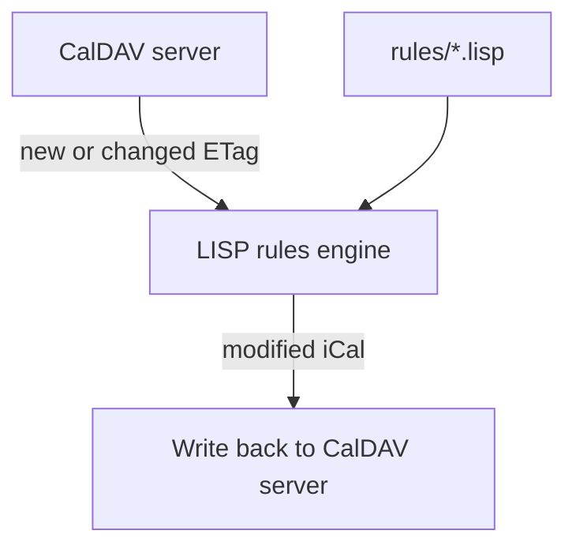

# CalDAV Automata

A lightweight Docker daemon that watches your CalDAV calendars and
automatically applies small LISP-defined rules whenever
events are created or updated by *any* client or user.

No proxy required. No server port exposed. Just connect your calendar apps
directly to your CalDAV provider as usual, and let CalDAV Automata
handle the automation in the background.

---

## How it works

CalDAV Automata polls your CalDAV accounts on a configurable interval. For
each calendar event it compares a cryptographic fingerprint (ETag) against a
local state file. When it finds something new or changed it runs your rules,
applies any actions (add attendees, set alerts, …), and writes the modified
event back to the server. The next poll picks up the server-assigned ETag and
the cycle becomes a no-op until the event changes again.



Rules are hot-reloaded from the `/rules` directory on every poll cycle — no
restart required.

---

## Quick start

### 1 — Prepare your CalDAV credentials

Use the credential type required by your provider:

- regular account password
- app-specific password (required by some providers, including iCloud)
- access token (if your provider supports it)

Check your provider's CalDAV documentation and create the correct credential
before continuing.

### 2 — Set up your secrets

The recommended approach is to mount your password as a Docker secret file
instead of passing it through the container environment:

```sh
mkdir -p secrets
printf '%s' 'your-caldav-password-here' > secrets/caldav_password.txt
chmod 600 secrets/caldav_password.txt
```

> `./secrets/` is listed in `.gitignore` and will never be committed.

If you prefer environment variables, the old `.env` flow still works:

```sh
cp .env.example .env
chmod 600 .env
```

```sh
CALDAV_PASSWORD=your-caldav-password-here
```

> `.env` is listed in `.gitignore` and will never be committed.

### 3 — Configure your calendars

Copy the template and edit your real config file:

```sh
cp config/calendar.example.yaml config/calendar.yaml
```

Then edit `config/calendar.yaml` with your CalDAV account details and the calendar
names you want to watch:

```yaml
# config/calendar.yaml
poll_interval: 30          # seconds between poll cycles
rules_dir: /rules          # path inside the container
state_folder: /data        # stores SQLite state DB (state.db)

accounts:
  - name: "Primary CalDAV"
    url: "https://caldav.example.com/"
    username: "you@example.com"
    password_file: "/run/secrets/caldav_password"
    organizer: "mailto:you@example.com"
    calendars:
      - "Family"
      - "Work"
```

If you prefer environment variables instead of a mounted secret file:

```yaml
accounts:
  - name: "Primary CalDAV"
    url: "https://caldav.example.com/"
    username: "you@example.com"
    password: "${CALDAV_PASSWORD}"   # resolved from .env at runtime
    calendars:
      - "Family"
      - "Work"
```

### CalDAV URL discovery
Use the base URL documented by your provider. The CalDAV library automatically
discovers your user-specific principal and calendar-home-set via `PROPFIND`,
so you usually do not need to hard-code a personal path.

For providers that publish a generic discovery endpoint (for example iCloud's
`https://caldav.icloud.com/`), use that documented base URL directly.

Calendar names support `fnmatch` wildcards. Use `["*"]` to watch every
calendar on an account.

CalDAV Automata automatically resolves the account owner address from the
principal `calendar-user-address-set`.

`calendars` entries are string patterns:

```yaml
calendars:
  - "Family*"
  - "Work"
```

When an `add-attendee` action runs, CalDAV Automata sets ORGANIZER only when
it is missing. It uses the resolved owner address from principal discovery.
The `organizer` config value is fallback-only and used only when discovery
fails or returns an unusable address.

### 4 — Write your first rule

Copy the rules template, then create your real `.lisp` rule files:

```sh
cp rules/example.lisp.example rules/my-rules.lisp
```

Only `*.lisp` files are loaded at runtime; `*.example.lisp` files are ignored.
Create additional `.lisp` files anywhere inside `./rules/`:

```lisp
; rules/family.lisp
(rule
  (when
    (calendar "Family"))

  (on-create
    (add-attendee "partner@example.com")
    (set-alert 15 "DISPLAY"))

  (on-update
    (add-attendee "partner@example.com")))
```

Rules are composable: a single `.lisp` file can contain multiple `rule`
blocks, and any number of files can live in the `rules/` directory.

### 5 — Start the daemon

```sh
docker compose up -d
```

Optional logging env vars:

- `LOG_LEVEL`: log threshold (`DEBUG`, `INFO`, `WARNING`, `ERROR`, `CRITICAL`).
- `LOG_COLOR`: color mode for terminal output (`auto`, `always`, `never`).
  Default is `auto` (colors only when stdout is a TTY). `NO_COLOR` disables
  colors in auto mode.

The shipped `docker-compose.yml` mounts `./secrets/caldav_password.txt` as the
Docker secret `/run/secrets/caldav_password`, which matches the
`password_file` example above. To build the image locally instead of pulling
from GHCR, swap the `image:` line in `docker-compose.yml` for the commented-out
`build: .` line.

For additional accounts, add more entries under `secrets:` in
`docker-compose.yml` and point each account's `password_file` at the matching
`/run/secrets/...` path.

### 5a — Docker Compose secret example

```yaml
services:
  caldav-automata:
    image: ghcr.io/johannrichard/caldav-automata:latest
    secrets:
      - caldav_password
    volumes:
      - caldav-state:/data
      - ./rules:/rules:ro
      - ./config:/config:ro

secrets:
  caldav_password:
    file: ./secrets/caldav_password.txt
```

### 5b — Secret injection options

- **Best default**: mount a secret file from Docker Compose, Docker Swarm,
  Kubernetes, ECS, or another orchestrator and use `password_file`.
- **Good with Proton Pass / `pass-cli`**: fetch the secret on the **host**
  before `docker compose up`, write it into `./secrets/caldav_password.txt`,
  then let Docker mount that file into the container.
- **Not recommended**: run `pass-cli`, a desktop keychain helper, or similar
  secret tooling *inside* the application container. That couples the image to a
  specific secret provider, adds extra credentials or device state into the
  container, and makes unattended restarts harder.
- **If you need dynamic retrieval**: use a small sidecar or entrypoint wrapper
  that writes a file into a mounted secret volume, then point `password_file`
  at that file. Keep the main app unaware of the secret provider.

### 6 — Pick a pinned image version in production

Published images are semantically versioned (`X.Y.Z`) and pushed with matching
floating tags (`X.Y`, `X`, and `latest`).

For production, pin `docker-compose.yml` to an explicit release tag:

```yaml
image: ghcr.io/johannrichard/caldav-automata:1.2.3
```

> Note: GHCR retention keeps only the 15 most recent releases, so older pinned
> tags are eventually pruned.

---

## Deployment options

- **Easiest and recommended**: Docker/Compose (already documented above).
- **No Docker, Python host**: install as a Python package and run with
  `systemd`.

If you want to run this on a server without cloning the repository, you can
install directly from GitHub.

### Install without cloning (Python)

Create a dedicated virtual environment and install from GitHub:

```sh
sudo mkdir -p /opt/caldav-automata
sudo chown "$USER":"$USER" /opt/caldav-automata
python3 -m venv /opt/caldav-automata/.venv
/opt/caldav-automata/.venv/bin/pip install \
  "git+https://github.com/johannrichard/caldav-automata.git"
```

This installs the `caldav-automata` CLI entrypoint from `pyproject.toml`. Example configuration
and rule files are installed into the venv's site-packages. Find them with:

```sh
SITE_PACKAGES=$(/opt/caldav-automata/.venv/bin/python -c "import site; print(site.getsitepackages()[0])")
ls $SITE_PACKAGES/config/
ls $SITE_PACKAGES/rules/
ls $SITE_PACKAGES/deploy/
```

Copy the examples to your system location:

```sh
SITE_PACKAGES=$(/opt/caldav-automata/.venv/bin/python -c "import site; print(site.getsitepackages()[0])")
sudo cp $SITE_PACKAGES/config/calendar.example.yaml /etc/caldav-automata/calendar.yaml
sudo cp $SITE_PACKAGES/deploy/systemd/caldav-automata.env.example /etc/default/caldav-automata
sudo cp $SITE_PACKAGES/deploy/systemd/caldav-automata.service /etc/systemd/system/
# Copy rule examples to your rules directory
sudo cp $SITE_PACKAGES/rules/*.lisp /etc/caldav-automata/rules/
```

Alternative (single-user install):

```sh
pipx install "git+https://github.com/johannrichard/caldav-automata.git"
```

With `pipx`, find the site-packages location:

```sh
SITE_PACKAGES=$(python -c "import site; print(site.getsitepackages()[0])")
ls $SITE_PACKAGES/config/
ls $SITE_PACKAGES/rules/
```

### Run with systemd

The provided `deploy/systemd/caldav-automata.service` assumes the project is
installed under `/opt/caldav-automata` (specifically the venv at
`/opt/caldav-automata/.venv`).

If you install elsewhere, update at least these unit fields to match your
paths before enabling the service:

- `WorkingDirectory`
- `ExecStart`
- `Environment=CONFIG_FILE` (or `/etc/default/caldav-automata`)

The service loads the CalDAV password from an encrypted systemd credential,
which is decrypted at runtime and exposed as `CALDAV_PASSWORD_FILE`. The
example `calendar.yaml` uses:

```yaml
password_file: "${CALDAV_PASSWORD_FILE}"
```

To set up the encrypted credential:

1. Create a temporary file with your password in `/run` (in-memory):

   ```sh
   sudo tee /run/caldav_password.txt <<< 'your-caldav-password' > /dev/null
   chmod 600 /run/caldav_password.txt
   ```

2. Encrypt it using `systemd-creds encrypt` (without `--pretty`):

   ```sh
   sudo systemd-creds encrypt --name caldav_password \
     </run/caldav_password.txt \
     >/var/caldav-automata/caldav_password.cred
   ```

3. Remove the temporary password file:

   ```sh
   sudo rm /run/caldav_password.txt
   ```

Keep the encrypted credential path in sync with the `LoadCredentialEncrypted=`
line in the unit file (default: `/var/caldav-automata/caldav_password.cred`).

Templates are provided in `deploy/systemd/`:

- `deploy/systemd/caldav-automata.service`
- `deploy/systemd/caldav-automata.env.example`

Typical setup after pip install:

```sh
SITE_PACKAGES=$(/opt/caldav-automata/.venv/bin/python -c "import site; print(site.getsitepackages()[0])")
sudo useradd --system --home /nonexistent --shell /usr/sbin/nologin caldav
sudo mkdir -p /etc/caldav-automata /var/caldav-automata /etc/default
sudo cp $SITE_PACKAGES/config/calendar.example.yaml /etc/caldav-automata/calendar.yaml
sudo cp $SITE_PACKAGES/deploy/systemd/caldav-automata.env.example /etc/default/caldav-automata
sudo cp $SITE_PACKAGES/deploy/systemd/caldav-automata.service /etc/systemd/system/
sudo chown caldav:caldav /var/caldav-automata
# Now set up the encrypted credential (see steps above)
sudo systemctl daemon-reload
sudo systemctl enable --now caldav-automata.service
sudo systemctl status caldav-automata.service
```

Logs:

```sh
journalctl -u caldav-automata.service -f
```

If `CONFIG_FILE` points outside your home directory, ensure permissions allow
the `caldav` user to read the config and any referenced secret files.
For systemd credentials, the service manages the decrypted runtime file under
`$CREDENTIALS_DIRECTORY`, so the YAML should reference the provided env var
instead of a literal password path.

---

## Docker image publishing and retention

- Release tags are created automatically on `main` by
  `.github/workflows/release.yml` using `python-semantic-release`.
- Docker images are published from `.github/workflows/docker-publish.yml`
  directly from the semantic release workflow, and only when semantic-release
  actually creates a new release.
- Docker tags are derived by `docker/metadata-action` semver rules
  (`X.Y.Z`, `X.Y`, `X`, and `latest`) without custom bash parsing.
- Each published image also gets a GitHub artifact attestation pushed to GHCR.
- After each publish, GHCR housekeeping prunes old releases and keeps only the
  latest 5 image versions for this package.

## Rule language

Rules are written in a simple S-expression dialect (LISP). Each rule
specifies which events/inbox items it applies to and what actions to run
when an event is created or updated, or when scheduling inbox messages arrive.

### Structure

```lisp
(rule
  (when
    (calendar "<name>")  ; one or more (calendar ...) clauses = OR match
    (calendar "<name>")) ; omit the (when ...) block entirely to match all

  (on-create             ; actions that run when a new event appears
    <action> …)

  (on-update             ; actions that run when an existing event changes
    <action> …)

  (on-invite-request     ; actions for inbox METHOD:REQUEST items
    <action> …)

  (on-invite-reply       ; actions for inbox METHOD:REPLY items
    <action> …)

  (on-invite-cancel      ; actions for inbox METHOD:CANCEL items
    <action> …)

  (on-invite-add         ; actions for inbox METHOD:ADD items
    <action> …))
```

The `when` block can also filter on the event **subject** (SUMMARY), **note**
(DESCRIPTION), **organizer** (ORGANIZER), and **start date** (`DTSTART`).
Subject, note, and organizer filters use `fnmatch` patterns, where `*` matches
any sequence of characters:

```lisp
(rule
  (when
    (calendar "Work")       ; must be in the Work calendar
    (subject "*standup*")   ; AND SUMMARY must contain "standup"
    (note "*action item*")  ; AND DESCRIPTION must contain "action item"
    (organizer "*@work.com")); AND ORGANIZER must match pattern
  …)
```

Date filters compare by calendar day. They accept either an ISO date like
`"2026-05-21"` or the relative value `"today"`:

```lisp
(rule
  (when
    (date-on "today"))
  …)

(rule
  (when
    (date-after "2026-05-21")
    (date-before "2026-06-01"))
  …)
```

Multiple values within the same condition type are OR'd; different condition
types are AND'd. A condition type that is omitted matches everything.

```lisp
; Matches the Work OR Team calendar, with any subject and any note.
(rule
  (when
    (calendar "Work")
    (calendar "Team"))
  …)

; Matches any calendar whose subject contains "urgent" OR "ASAP".
(rule
  (when
    (subject "*urgent*")
    (subject "*ASAP*"))
  …)

; Matches events that start within a fixed date window.
(rule
  (when
    (date-after "2026-05-21")
    (date-before "2026-06-01"))
  …)

; Matches inbox/event items from one organizer.
(rule
  (when
    (calendar "inbox")
    (organizer "manager@work.com"))
  …)
```

### Actions

| Action | Description |
| --- | --- |
| `(add-attendee "email@example.com")` | Add attendee (idempotent) |
| `(add-attendee ... optional args ...)` | Add attendee with optional params |
| `(set-alert mins type)` | Add/replace alert (`DISPLAY`, `EMAIL`, `AUDIO`) |
| `(copy-to-calendar "Target Name")` | Copy event to another calendar (idempotent by UID) |
| `(accept-invite)` | Accept inbox invite request (`METHOD:REQUEST`) |
| `(decline-invite)` | Decline inbox invite request (`METHOD:REQUEST`) |
| `(tentative-invite)` | Tentatively accept `METHOD:REQUEST` invite |
| `(delete-inbox-item)` | Delete current inbox item after processing |

#### add-attendee optional parameters

```lisp
(add-attendee "email@example.com" "Full Name"
              role "REQ-PARTICIPANT"
              partstat "NEEDS-ACTION"
              rsvp "TRUE"
              schedule-agent "SERVER")
```

- `role`: iTIP role in the invite.
  Typical values: `REQ-PARTICIPANT`, `OPT-PARTICIPANT`,
  `NON-PARTICIPANT`, `CHAIR`.
- `partstat`: initial participation status.
  Typical values: `NEEDS-ACTION`, `ACCEPTED`, `DECLINED`,
  `TENTATIVE`, `DELEGATED`.
  Note: when `schedule-agent` is `SERVER` (or omitted), this project
  coerces `partstat` to `NEEDS-ACTION` to align with RFC 6638 organizer
  scheduling expectations and avoid server-side precondition failures.
- `rsvp`: whether a reply is requested.
  Typical values: `TRUE` or `FALSE` (also accepts `yes/no/1/0`).
- `schedule-agent`: scheduling responsibility hint.
  Typical values: `SERVER` (server sends iTIP, recommended default),
  `CLIENT` (client/tool sends iTIP), `NONE` (no scheduling messages).

Parameter names are case-insensitive; values are normalized to upper-case.

#### copy-to-calendar

```lisp
(copy-to-calendar "Target Calendar Name")
```

Copies the matching event into another calendar on **the same account**.  The
copy is idempotent: if an event with the same `UID` already exists in the
target calendar the action is skipped silently, so it is safe to use in both
`on-create` and `on-update` blocks.

The source event is **not** modified by this action — it does not trigger a
write-back to the server unless another action in the same rule also changes
the event.

Typical use cases:

- Mirror select events from a read-only subscribed calendar into a personal,
  editable calendar.
- Aggregate events from several source calendars into one consolidated view.
- Keep a lightweight "copy" of filtered work events in a home calendar.

> **Note:** `copy-to-calendar` targets any calendar visible on the account,
> regardless of which calendars are listed under `calendars:` in your config.
> The target calendar must already exist on the server — the action does not
> create it.

---

## ICS feeds

Some calendars are published as plain `.ics` files over HTTP or HTTPS — think
Google Calendar public links, community event feeds, or conference schedules.
CalDAV Automata can poll those feeds and apply your existing LISP rules to
every event they contain, no credentials required.

### How it works

On each poll cycle the daemon fetches every configured ICS feed URL using
conditional HTTP (`If-None-Match` / `If-Modified-Since`) so that unchanged
feeds cost only a lightweight 304 response. For each VEVENT it has not seen
before it applies matching rules in exactly the same way as CalDAV events.

Because ICS feeds are read-only, any iCal modifications produced by
`add-attendee`, `set-alert`, and similar actions are silently discarded — they
cannot be written back to the source. What *does* work across feeds is
`copy-to-calendar`: the daemon copies new matching events into any writable
CalDAV calendar on any of your configured accounts.

### Calendar name

The name used to match `(calendar "…")` clauses in your rules is resolved in
this order:

1. The `X-WR-CALNAME` property inside the ICS file (most public feeds include this).
2. The `name:` field in your config entry (useful when the feed omits `X-WR-CALNAME`).
3. The raw URL, as a last resort.

### Configuration

Add an `ics_feeds` list alongside `accounts` in your `calendar.yaml`:

```yaml
ics_feeds:
  - url: "https://calendar.google.com/calendar/ical/hello%40summerofprotocols.com/public/basic.ics"
    name: "Summer of Protocols"   # optional fallback; X-WR-CALNAME takes precedence

  - url: "https://example.com/team-holidays.ics"
    # name is optional — the daemon reads it from X-WR-CALNAME when present
```

### Rule example

```lisp
; Copy every new event from an ICS feed into a personal calendar.
(rule
  (when
    (calendar "Summer of Protocols"))
  (on-create
    (copy-to-calendar "Personal")))

; Copy only events that contain "workshop" in their title.
(rule
  (when
    (calendar "Summer of Protocols")
    (subject "*workshop*"))
  (on-create
    (copy-to-calendar "Work")))
```

The `copy-to-calendar` target can be any calendar on any of your configured
CalDAV accounts, not just those on a specific account.

---

### Examples

```lisp
; Invite a colleague to every new Work event and set a 30-minute alert.
(rule
  (when
    (calendar "Work"))
  (on-create
    (add-attendee "colleague@work.com")
    (set-alert 30 "DISPLAY")))

; Notify a family group for any calendar that starts with "Family".
(rule
  (when
    (calendar "Family*"))
  (on-create
    (add-attendee "family-group@example.com")
    (set-alert 10 "DISPLAY"))
  (on-update
    (add-attendee "family-group@example.com")))

; Set a default alert on every new event regardless of calendar.
(rule
  (on-create
    (set-alert 15 "DISPLAY")))

; Add a reminder only for events after a cutoff date.
(rule
  (when
    (calendar "Work")
    (date-after "2026-05-21"))
  (on-create
    (set-alert 30 "DISPLAY")))

; Auto-accept specific invites from scheduling inbox and clean them up.
(rule
  (when
    (subject "*standup*")
    (organizer "manager@work.com"))
  (on-invite-request
    (accept-invite)
    (delete-inbox-item)))

; Remove organizer reply notifications from inbox.
(rule
  (on-invite-reply
    (delete-inbox-item)))

; Remove organizer cancellation notifications from inbox.
(rule
  (on-invite-cancel
    (delete-inbox-item)))

; Copy every new event from a subscribed (read-only) calendar into a personal calendar.
(rule
  (when
    (calendar "Subscribed Calendar"))
  (on-create
    (copy-to-calendar "Personal")))

; Copy only work events containing "offsite" into a shared team calendar.
(rule
  (when
    (calendar "Work")
    (subject "*offsite*"))
  (on-create
    (copy-to-calendar "Team"))
  (on-update
    (copy-to-calendar "Team")))
```

### Debug logging

Set `LOG_LEVEL=DEBUG` to see extra trace output, including the title of each
new or updated event as it is processed.

---

## Configuration reference

| Key | Default | Description |
| --- | --- | --- |
| `poll_interval` | `30` | Seconds between poll cycles |
| `rules_dir` | `/rules` | Directory scanned for `*.lisp` rule files |
| `state_folder` | `/data` | Folder containing SQLite state DB (`state.db`) |
| `state_db_file` | derived from `state_folder` | Optional DB path override |
| `accounts` | *(required)* | List of CalDAV account objects |
| `ics_feeds` | *(optional)* | List of read-only ICS feed objects |

### Account object

| Key | Description |
| --- | --- |
| `name` | Display name used in log output |
| `url` | CalDAV base URL from your provider |
| `username` | Account username/login for that provider |
| `password` | Account password or `${ENV_VAR}` reference |
| `organizer` | *(optional)* Fallback-only organizer when discovery fails |
| `calendars` | Calendar names/wildcards to watch; `["*"]` watches all |
| `ssl_verify_cert` | *(optional)* `true` (default) or `false` |
| `auth_type` | *(optional)* Auth type, e.g. `"basic"` or `"digest"` |
| `headers` | *(optional)* Extra HTTP headers sent with every request |

`calendars` entries must be plain strings.

### ICS feed object

| Key | Description |
| --- | --- |
| `url` | Full HTTPS URL of the `.ics` file |
| `name` | *(optional)* Fallback display name; `X-WR-CALNAME` from the ICS takes precedence |

---

## Docker volumes

| Volume | Purpose |
| --- | --- |
| `/data` | Persistent SQLite state DB (`state.db`) — mount a named volume |
| `/rules` | LISP rule files — mount read-only from your project |
| `/config` | Configuration directory — mount read-only |

---

## Environment variables

| Variable | Default | Description |
| --- | --- | --- |
| `CONFIG_FILE` | `/config/calendar.yaml` | Path to the configuration file |
| `LOG_LEVEL` | `INFO` | Python logging level (for example `DEBUG` or `INFO`) |
| Any `${VAR}` used in config | — | Expanded from environment at load time |

---

## Development formatting (Black)

This repository uses [Black](https://black.readthedocs.io/) for Python code
formatting.

Install development dependencies:

```sh
python -m pip install -r requirements-dev.txt
```

Format all Python code:

```sh
black .
```

Check formatting without modifying files:

```sh
black --check .
```

Formatting is also enforced in CI by `.github/workflows/python-format.yml`.

---

## Compatible CalDAV servers

- **Apple iCloud** — uses App-Specific Passwords; principal discovery is
  handled automatically. Scheduling/invite inbox rules run only when
  scheduling support is detected for the account.
- **Nextcloud** — use the CalDAV URL shown in the *Settings › Personal info*
  section.
- **Baikal**, **Radicale**, **DAViCal**, **Fastmail**, and any other
  CalDAV-compliant server.

---

## Project layout

```text
caldav_automata/
  __init__.py     package init
  config.py       YAML config loader with ${ENV_VAR} expansion
  daemon.py       polling daemon — ETag tracking, rule dispatch, write-back
  lisp.py         S-expression parser and rule compiler
  actions.py      add-attendee, set-alert, and other action handlers
  main.py         entry point (python -m caldav_automata.main)
config/
  calendar.example.yaml   example configuration template (not loaded)
rules/
  example.lisp.example    starter rule template (not loaded)
Dockerfile        single-process container image
docker-compose.yml  example Compose deployment
deploy/systemd/   systemd service templates for host installs
```

---

## Licence

MIT — see [LICENSE](LICENSE).
